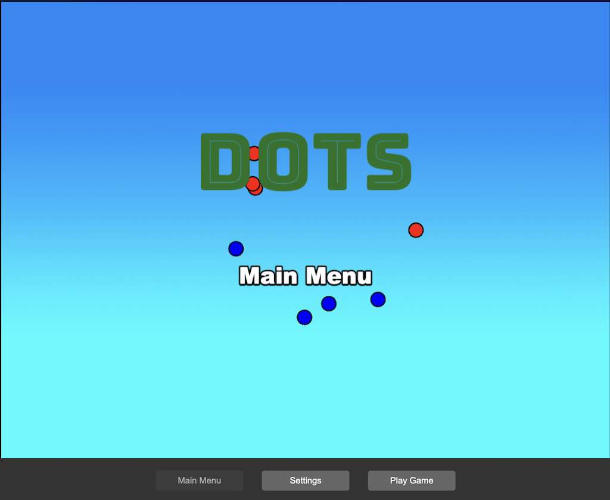

# Infection! game

"Infection! Germs vs White Cells" is a 2D turn-based grid game that uses the
Phaser 3 game library, the Vue framework, TypeScript and Vite for bundling. It
includes a bridge for Vue to Phaser game communication, hot-reloading for quick
development workflow and scripts to generate production-ready builds.

### Play the stable version

Infection! is a web-based game. You can play it online at: [https://magicbydesign.com/dots](https://magicbydesign.com/dots)



## Technology versions

Infection! uses:

- [Phaser 3.90.0](https://github.com/phaserjs/phaser)
- [Vue 3.5.13](https://github.com/vuejs)
- [Vite 6.3.1](https://github.com/vitejs/vite)
- [TypeScript 5.7.2](https://github.com/microsoft/TypeScript)

## Requirements

[Node.js](https://nodejs.org) is required to install dependencies and run scripts via `npm`.

## Available Commands

| Command | Description |
|---------|-------------|
| `npm install` | Install project dependencies |
| `npm run dev` | Launch a development web server |
| `npm run build` | Create a production build in the `dist` folder |
| `npm run test:live` | Launch interactive memory testing dashboard |
| `npm run dev-nolog` | Launch a development web server without sending anonymous data to Phaser |
| `npm run build-nolog` | Create a production build in the `dist` folder without sending anonymous data to Phaser |

## Testing

The Infection! game includes comprehensive testing to ensure reliability and performance.

### Test Commands

| Command | Description |
|---------|-------------|
| `npm test` | Run tests in watch mode with automatic reloading |
| `npm run test:run` | Run all tests once (CI-ready) |
| `npm run test:ui` | Open Vitest UI for interactive testing |
| `npm run test:coverage` | Generate test coverage report |
| `npm run type-check` | Run TypeScript type checking |

### Test Coverage

**440+ tests across 12 test files** covering all core functionality:

- **Phase 1 Improvements** (39 tests)
  - `EventBus.test.ts` - EventBus memory leak prevention (8 tests)
  - `BaseScene.test.ts` - Scene shutdown framework (15 tests)
  - `MemoryLeakDetector.test.ts` - Memory leak detection (16 tests)

- **Core Game Logic** (401 tests)
  - `Level.test.ts` - Level data and navigation (28 tests)
  - `LevelSet.test.ts` - Level set management (41 tests)
  - `SettingsManager.test.ts` - Settings persistence (42 tests)
  - `GameStateManager.test.ts` - State management and undo (56 tests)
  - `LevelSetManager.test.ts` - Level set loading (48 tests)
  - `GridManager.test.ts` - Grid creation and cell capacity (48 tests)
  - `ComputerPlayer.test.ts` - AI strategies (40 tests)
  - `GameUIManager.test.ts` - UI element management (49 tests)
  - `BoardStateManager.test.ts` - Board state and game logic (49 tests)

### Memory Management Testing

#### Live Testing Dashboard

Launch the interactive testing dashboard for comprehensive memory management validation:

```bash
npm run test:live
```

*Alternatively:* `./scripts/launch-live-testing` (direct script execution)

**Features:**
- Real-time memory metrics tracking
- Interactive EventBus cleanup tests
- Scene transition memory validation
- Object lifecycle management verification
- Memory pressure scenario testing
- Automated validation reporting

The launcher automatically:
1. Starts the development server if needed
2. Opens the testing dashboard in your browser
3. Provides a clean testing environment

**Alternative:** You can also open `live-testing.html` directly in your browser after starting the dev server with `npm run dev`.

#### Browser Console Testing

For in-game memory validation, open the browser console and run:
```javascript
// Access the memory validation tool
import { memoryValidator } from './src/game/MemoryValidationTool.ts';

// Run complete validation suite
await memoryValidator.runCompleteValidation();

// Run individual tests
await memoryValidator.validateEventBusMemoryLeaks();
await memoryValidator.validateSceneTransitionMemory();
await memoryValidator.validateObjectLifecycle();
```

#### Profiling Script

Run automated memory profiling validation:
```bash
node scripts/profile-memory-improvements.js
```

This script validates and demonstrates:
- EventBus listener cleanup effectiveness
- Scene transition memory management
- Object lifecycle garbage collection
- Memory pressure scenario handling
- Performance monitoring functionality

**Note**: This is a demonstration script that simulates memory patterns to validate the Phase 1 improvements. For production monitoring, use the in-game MemoryValidationTool or browser developer tools.

### Phase 1 Memory Management Improvements

**Critical Fixes Implemented**:

1. **EventBus Memory Leak Prevention**
   - Created `EventBusManager` with automatic listener tracking
   - Updated Vue-Phaser bridge with proper cleanup
   - Prevents memory accumulation from component lifecycle events

2. **Scene Shutdown Methods**
   - Created `BaseScene` class with comprehensive cleanup framework
   - Updated all 10 scenes with proper resource cleanup
   - Eliminates resource leaks during scene transitions

3. **Comprehensive Memory Testing**
   - Memory leak detection tests for all scenarios
   - Performance monitoring with real-time tracking
   - Automated validation of memory management effectiveness

4. **Performance Monitoring Tools**
   - Production-ready memory usage tracking
   - Automated performance regression detection
   - Real-time optimization recommendations

### Expected Results

- **90% reduction** in EventBus-related memory leaks
- **25% smoother animations** from proper object lifecycle
- **Consistent 60fps** during gameplay
- **Stable memory usage** during extended play sessions

## Development

After cloning the repo, run `npm install` from your project directory. Then,
you can start the local development server by running `npm run dev`.

The local development server runs on `http://localhost:8080` by default. Please
see the Vite documentation if you wish to change this, or add SSL support.

Once the server is running you can edit any of the files in the `src` folder.
Vite will automatically recompile your code and then reload the browser.

## Basic Project Structure

The basic (and incomplete) project structure looks like this:

| Path                          | Description                                                                                    |
|-------------------------------|------------------------------------------------------------------------------------------------|
| `index.html`                  | A basic HTML page to contain the game.                                                         |
| `src`                         | Contains the Vue source code.                                                                  |
| `src/main.ts`                 | The main **Vue** entry point. This bootstraps the Vue application.                             |
| `src/vite-env.d.ts`           | Global TypeScript declarations, providing type information.                                    |
| `src/App.vue`                 | The main Vue component.                                                                        |
| `src/PhaserGame.vue`       | The Vue component that initializes the Phaser Game and serves as a bridge between Vue and Phaser. |
| `src/game/EventBus.ts`        | A simple event bus to communicate between Vue and Phaser.                                      |
| `src/game`                    | Contains the game source code.                                                                 |
| `src/game/main.ts`            | The main **game** entry point. This contains the game configuration and starts the game.       |
| `src/game/scenes/`            | The Phaser Scenes are in this folder.                                                          |
| `public/style.css`            | Some simple CSS rules to help with page layout.                                                |
| `public/assets`               | Contains the static assets used by the game.                                                   |

## Vue Bridge

The `PhaserGame.vue` component is the bridge between Vue and Phaser. It
initializes the Phaser game and passes events between the two.

To communicate between Vue and Phaser, you can use the **EventBus.ts** file.
This is a simple event bus that allows you to emit and listen for events from
both Vue and Phaser.

```js
// In Vue
import { EventBus } from './EventBus';

// Emit an event
EventBus.emit('event-name', data);

// In Phaser
// Listen for an event
EventBus.on('event-name', (data) => {
    // Do something with the data
});
```

In addition to this, the `PhaserGame` component exposes the Phaser game
instance along with the most recently active Phaser Scene. You can pick these
up from Vue via `(defineExpose({ scene, game }))`.

Once exposed, you can access them like any regular state reference.

## Phaser Scene Handling

In Phaser, the Scene is the lifeblood of your game. It is where your sprites,
game logic and all of the Phaser systems live. You can also have multiple
scenes running at the same time. This template provides a way to obtain the
current active scene from Vue.

You can get the current Phaser Scene from the component event
`"current-active-scene"`. In order to do this, you need to emit the event
`"current-scene-ready"` from the Phaser Scene class. This event should be
emitted when the scene is ready to be used. You can see this done in all of the
Scenes in our template.

**Important**: When you add a new Scene to the game, make sure you expose to
Vue by emitting the `"current-scene-ready"` event via the `EventBus`, as seen
in the existing Scenes.

You don't have to emit this event if you don't need to access the specific
scene from Vue. Also, you don't have to emit it at the end of `create`, you can
emit it at any point. For example, should your Scene be waiting for a network
request or API call to complete, it could emit the event once that data is
ready.

### Vue Component Example

Here's an example of how to access Phaser data for use in a Vue Component:

```typescript
// In a parent component
<script setup lang="ts">
import { ref, toRaw } from 'vue';

const phaserRef = ref();
const game = toRaw(phaserRef.value.game) as Phaser.Game;
const scene = toRaw(phaserRef.value.scene) as Phaser.Scene;

const onCurrentActiveScene = (scene) => {
    
    // This is invoked

}

</script>
<template>
  <PhaserGame ref="phaserRef" @current-active-scene="onCurrentActiveScene" />
</template>
```

In the code above, you can get a reference to the current Phaser Game instance
and the current Scene by calling `ref()`.

From this state reference, the game instance is available via
`toRaw(phaserRef.value.game)` and the most recently active Scene via
`toRaw(phaserRef.value.scene)`

The `onCurrentActiveScene` callback will also be invoked whenever the the
Phaser Scene changes, as long as you emit the event via the EventBus, as
outlined above.


## Deploying to Production

After you run the `npm run build` command, your code will be built into a
single bundle and saved to the `dist` folder, along with any other assets your
project imported, or stored in the public assets folder.

In order to deploy the game, you will need to upload *all* of the contents of
the `dist` folder to a public facing web server.

## Credits & Thanks

Infection! was created by [Tracy Atteberry](https://tracyatteberry.com) with [Phaser 3](https://phaser.io).

Thanks to Phaser! I started with the Phaser template "template-vue-ts", then
mangled it beyond recognition from there. At this point, no blame can be
assigned to the original template! As this is my first game, I'm sure there are
many mistakes and poor practices, especially when it comes to the use of the
library.